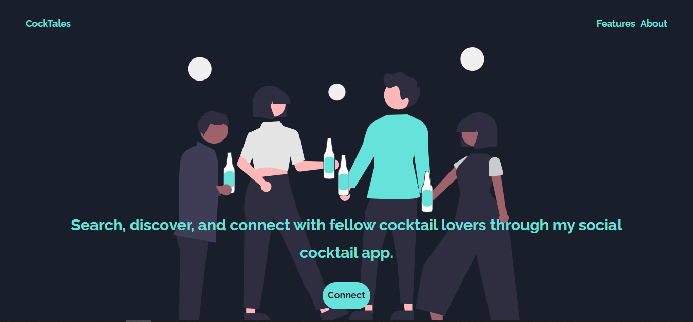
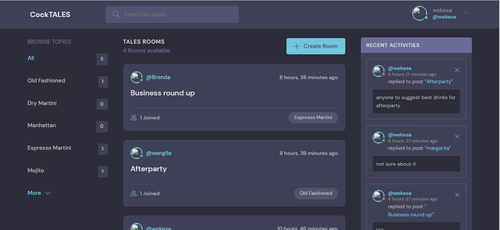

<h1>COCTALES WEB APP</h1>
<h2>Search, discover, and connect with fellow cocktail lovers through my social cocktail app.</h1>

<h3>The app offers this functionality</h3>
<h4>Social sharing</h4>

Allow users to share their experiences and content on this media  
  platform through cocktale rooms, which can help promote your app and 
  increase user engagement.

<h4>User profile</h4>

Allow users to create profiles that showcase their favorite cocktails, bars, and reviews. 
    Users can follow each other and connect with like-minded cocktail enthusiasts.

<h4>Cocktail categories</h4>

provides information on the different categories of cocktails, including 
    classics, popular drinks, and seasonal drinks. Users can also create their own
    indegenous categories 

